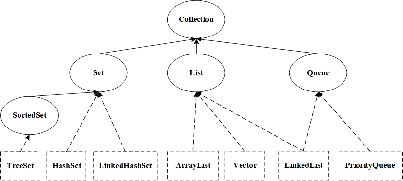

# Java学习笔记-01  集合

## JAVA集合框架

&emsp;&emsp;Java集合类库将接口（interface）与实现（implementation）分离。  
&emsp;&emsp;Java中的集合包括Collection和Map两种，Collection存储着对象的集合，而Map存储着键值对的映射表。  

### Collection接口

&emsp;&emsp;在JAVA类库中，集合类的基本接口是Collection接口，这个接口有两个基本方法：

```java
public interface Collection<E>{
    //集合中不允许有重复对象
    boolean add(E element);
    Iterator<E> iterator();
}
```

&emsp;&emsp;实现了Collection接口的类如下图所示：  



|数据结构|实现类|
|:---:|---|
|Set|# TreeSet：基于红黑树实现；有序；查找效率O(logN)<br># HashSet：基于散列表实现；无序，使用Iterator遍历结果不确定；查找效率O(1)<br># LinkedHashSet：内部使用双向链表维护插入顺序；查找效率O(1)|
|List|# ArrayList：基于动态数组实现；随机访问<br># Vector：类似ArrayList；线程安全<br># LinkedList：基于双向链表实现；顺序访问；快速插入删除；可用作栈、队列、双向队列|
|Queue|# LinkedList：可以用来实现双向队列<br># PriorityQueue：基于堆结构来实现；可以实现优先队列|

### Map接口

&emsp;&emsp;Map接口的基本方法有

```java
public interface Map<E>{
    V put(K key,V value);
    V get(Object value);
}
```

&emsp;&emsp;实现了Map接口的类如下图所示：  


|实现类|描述|
|---|---|
|TreeMap|基于红黑树实现|
|HashMap|基于散列表实现|
|HashTable|和HashMap类似；线程安全|
|LinkedHashMap|使用双向链表来维护元素的顺序|

**补充**：虽然HashTable是线程安全的，但是它是遗留类，可以使用ConcurrentHashMap来实现线程安全，它的效率更高，且加入分段锁。

### 迭代器

#### Iterator接口

&emsp;&emsp;Iterator接口包含了4个方法：

```java
public interface Iterator<E>{
    E next;
    boolean hasNext();
    void remove();
    default void forEachRemaining()
}
```

&emsp;&emsp;反复调用next方法，可以逐个访问集合中的每一个元素，到集合末尾时将抛出`NoSuchElementException`异常，所以调用next之前需要调用`hasNext()`方法。遍历举例如下：

```java
Collection<String> c="";
Iterator<String> iter=c.iterator();
while (iter.hasNext()){
    String element=iter.next();
}
```

#### Iterable接口

&emsp;&emsp;Iterable接口只包含了一个抽象方法：

```java
public interface Iterable<E>{
    Iterator<E iterator();
}
```

&emsp;&emsp;JDK1.5之后，实现了Iterable接口的对象都可以用"for each"循环来实现元素的遍历。

```java
for (String element : c){
    System.out.println(element);
}
```
