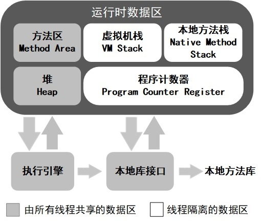

# Java学习笔记-03  JVM

## 0 目录：

* [1 Java内存区域](#1-Java内存区域)
* 虚拟机垃圾算法
* 虚拟机垃圾收集器
* jvm内存管理
* jvm调优

## 1 Java内存区域

&emsp;&emsp;Java虚拟机在执行Java程序的过程中会把它所管理的内存划分为若干个不同的数据区域。

其中，线程私有的数据区域有：

* 程序计数器
* 虚拟机栈
* 本地方法栈

线程共享的数据区域有：

* 堆
* 方法区
* 直接内存

### 1.1 程序计数器

&emsp;&emsp;程序计数器是一块较小的内存空间，它主要有两个作用：

1. 字节码解释器工作就是通过改变这个计数器的值来取下一条所需要执行的字节码指令，如分支、循环、跳转、异常处理、线程恢复等。

2. Java虚拟机的多线程是通过线程轮流切换并分配处理器执行时间的方式来实现的，任何确定时刻，一个处理器都只会执行一条线程指令。因此，为了线程切换后能恢复到正确的执行位置，每条线程都需要有一个独立的程序计数器。

&emsp;&emsp;线程执行Java方法，计数器记录的是虚拟机字节码指令地址；线程执行Native方法，计数器值为空。

**程序计数器是唯一一个在Java虚拟机规范中没有规定OutOfMemoryError情况的区域**。

### 1.2 Java虚拟机栈

&emsp;&emsp;虚拟机栈描述的是Java方法执行的内存模型：每个方法在执行的同时都会创建一个`栈帧`，用于存储`局部变量表`、`操作数栈`、`动态链接`、`方法出口`等信息。每一个方法从调用直至执行完成的过程，就对应着一个栈帧在虚拟机栈中入栈到出栈的过程。