# 网络协议

>参考：  
>1、图解TCPIP  
>2、图解HTTP  

## 目录

* [1 网络基础知识](#1-网络基础知识)
* [2 TCP/IP基础知识](#2-TCP/IP基础知识)
* [3 数据链路](#3-数据链路)
* [4 IP协议](#4-IP协议)
* [5 IP协议相关技术](#5-IP协议相关技术)
* [6 TCP与UDP](#6-TCP与UDP)
* [7 HTTP](#7-HTTP)

## 1 网络基础知识

### 1.1 协议与OSI参考模型

* *OSI参考模型*：Open Systems Interconnection，开放式通信系统互联参考模型。  
* *OSI参考模型分层*：（由上而下）`应用层、表示层、会话层、传输层、网络层、数据链路层、物理层`。在这个模型中，每个分层都接收由它下一层所提供的特定服务，并且负责为自己的上一层提供特定的服务。  
* *接口*：上下层之间进行交互时所遵循的约定。
* *协议*：同一层之间的交互所遵循的约定。
* *各分层的职能*：
  * *应用层*：为应用程序提供服务并规定应用程序中通信相关的细节。
  * *表示层*：主要负责数据格式的转换。
  * *会话层*：负责决定建立连接和断开连接的时机，以及数据的分割等数据传输相关的管理。
  * *传输层*：进行建立连接和断开连接的处理，以及保证数据传输的可靠性。
  * *网络层*：在网络与网络相互连接的环境中，将数据从发送端主机发送到接收端主机。
  * *数据链路层*：在通过传输介质互连的设备之间进行数据处理。（注：网络层和数据链路层都是基于目标地址将数据发送到接收端，网络层负责将整个数据发送给最终目标地址，数据链路层只负责发送一个分段内的数据）
  * *物理层*：将数据的0、1转换为电压和脉冲光传输给物理的传输介质，在相互直连的设备之间使用地址实现传输。

### 1.2 传输方式的分类

* 面向有连接型与面向无连接型
* 电路交换与分组交换
* 根据接收端数量分类：单播、广播、多播、任播

### 1.3 地址

* *常用地址*：MAC地址、IP地址、端口号。
* *地址的唯一性*：同一个通信网络中不允许有两个相同地址的通信主体存在。
* *地址的层次性*：IP地址（网络号、主机号）
* *寻址*：地址转发表（MAC地址）、路由控制表（IP地址）

### 1.4 网络构成要素

* *网卡*：使计算机联网的设备
* *中继器*：物理层上延长网络的设备
* *网桥 / 2层交换机*：数据链路层上延长网络的设备
* *路由器 / 3层交换机*：网络层转发分组数据的设备
* *4~7层交换机*：处理传输层以上各网络传输的设备
* *网关*：转换协议的设备

## 2 TCP/IP基础知识

### 2.1 TCP/IP具体含义

&emsp;&emsp;TCP/IP一词泛指利用IP进行通信时所必须用到的协议群的统称，有时也称TCP/IP为网际协议族。

|TCP/IP协议群|应用举例|
|---|---|
|应用协议|HTTP（超文本传输协议）、SMTP（简单邮件传输协议）、FTP（文件传输协议）、TELNET（远程终端协议）、SNMP（简单网络管理协议）|
|传输协议|TCP（传输控制协议）、UDP（用户数据报协议）|
|网际协议|IP（网际协议）、ICMP（控制报文协议）、ARP（地址解析协议）|
|路由控制协议|RIP（路由信息协议）、IGP（内部网关协议）、BGP（边界网关协议）|

### 2.2 TCP/IP分层模型

&emsp;&emsp;TCPIP模型分层为（从上而下）：`应用层、传输层、互联网层、网络接口层、硬件`。

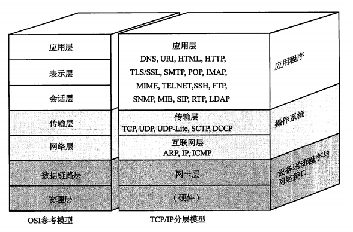

* 应用程序
  * *应用层*：将OSI参考模型中的`会话层、表示层和应用层`的功能都集中到了应用程序中。
* 操作系统
  * *传输层*：功能与OSI参考模型中的`传输层`类似，最主要的功能就是能够让应用程序之间实现通信（计算机内部同一时间通常运行着多个程序，设别这些应用程序的`端口号`）。
  * *互联网层*：相当于OSI参考模型中的`网络层`，使用IP协议，基于IP地址转发分包数据。
* 设备驱动程序与网络接口
  * *网络接口层*：利用`数据链路层`进行通信，在操作系统和硬件之间起桥梁作用。
  * *硬件*；负责数据传输的硬件，相当于`物理层`的设备。

### 2.3 分组数据包

&emsp;&emsp;经过数据链路的包可以简化成下面的结构：

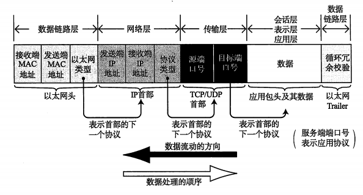

## 3 数据链路

### 3.1 数据链路的作用

&emsp;&emsp;计算机以二进制0、1来表示信息，实际的通信媒介之间处理的时电压的高低、电波强弱等信号。将这些信号与二进制0、1进行转换是`物理层`
的责任，`数据链路层`处理的数据也不是单纯的0、1序列，而是将它们集合为一个叫做“帧”的块，然后再进行传输。  
&emsp;&emsp;数据链路可以被视为网络传输中的最小单位。

### 3.2 数据链路相关技术

#### 3.2.1 MAC地址

&emsp;&emsp;MAC地址用于识别数据链路中互连的节点。  
&emsp;&emsp;MAC地址长48比特，在使用网卡（NIC）的情况下，MAC地址一般会被烧入到ROM中，因此任何一个网卡的MAC地址都是唯一的。  

#### 3.2.2 共享介质型网络

&emsp;&emsp;共享介质型网络指由多个设备共享一个通信介质的一种网络。  
&emsp;&emsp;设备之间使用同一个载波信道进行发送和接收。  
&emsp;&emsp;基本上采用半双工通信。  
&emsp;&emsp;共享介质型网络中有两种介质访问控制方式：一种是争用方式，另一种是令牌传递方式。

* *争用方式*：
  * 争夺获取数据传输的权力，也叫CSMA（载波监听多路访问）。
  * 先到先得，容易产生冲突，导致网络拥堵和性能下降。
  * 改良——CSMA/CD：检查是否发生冲突，如冲突，释放信道。
* *令牌传递方式*：
  * 沿令牌环发送令牌（特殊报文），获得令牌的站才能发送数据。
  * 不会有冲突，每个站平等循环获得令牌，网络拥堵不影响性能。
  * 改良——早期令牌释放、令牌追加。

#### 3.2.3 非共享介质网络

&emsp;&emsp;指不共享介质，对介质采取专用的一种传输控制方式。  
&emsp;&emsp;每个站直连交换机，由交换机负责转发数据帧。  
&emsp;&emsp;通常采用全双工通信方式。  
&emsp;&emsp;一旦交换机发生故障，与之相连的计算机之间将无法通信。

#### 3.2.4 根据MAC地址转发

&emsp;&emsp;交换机是个多端口网桥，根据每个帧的目标MAC地址，决定从哪个网络接口发送数据，用来记录发送接口的表叫做`转发表`。

#### 3.2.5 环路检测技术

&emsp;&emsp;网桥连接网络出现环路，数据帧可能会在环路中被持续转发，从而导致网络瘫痪。  
&emsp;&emsp;解决方法有两种：生成树和源路由两种方式。

* 生成树方式：
  * 每个网桥必须在每1~10s内交换包，判断使用和禁用哪些端口。
  * 以某个网桥构造树的根，对每个端口设置权重。
  * 发生故障时切换时长较长，解决：RSTP（Rapid Spanning Tree Protocol）。
* 源路由法：
  * 解决令牌环网络的问题。
  * 判断发送数据的源地址通过哪个网桥传输，将帧写入RIF（Routing Information Field)，网桥根据RIF信息进行转发。

### 3.3 以太网

&emsp;&emsp;众多数据链路中最为著名、使用最广泛的莫过于以太网（Ethernet，意为介质）。

#### 3.3.1 连接方式

* 初期采用同轴电缆（共享介质型）
* 现在一般采用终端和交换机之间独占电缆

#### 3.3.2 以太网帧格式

* 前导码：表示以太网帧的开始。前导码末尾为SFD（帧首定界符），值为11。前导码占8个字节。
* 主体：6字节目标MAC、6字节源MAC、2字节上层协议类型，以及数据
* 帧尾（FCS）：帧检验序列，4字节

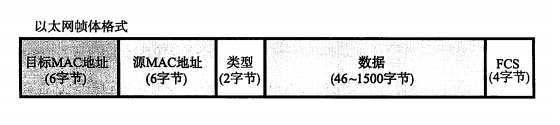

### 3.4 无线通信

|分类|标准化组织|相关技术|
|---|---|---|
|短距离|-|RF-ID|
|无线PAN|IEEE802.15|蓝牙|
|无线LAN|802.11|Wi-Fi|
|无线MAN|802.16、802.20|WiMAX|
|无线WAN|GSM、CDMA2000等|3G、4G、5G等|

### 3.5 PPP

&emsp;&emsp;PPP(Point-to-Point Protocol)是指点对点即1对1连接计算机的协议。  
&emsp;&emsp;PPP连接通常要进行用户名密码的验证，并对通信双端进行双向验证，验证有两种：PAP和CHAP。

* PAP（Password Authentication Protocol）：两次握手进行用户名和密码验证，密码以明文方式传输，安全性低。
* CHAP（Challenge Handshake Authentication Protocol）：使用一次性密码OTP，有效防止监听。

### 3.6 其他数据链路

* ATM：异步传输模式。以信元（5字节首部+48字节数据）为单位传输，特点：占用时间短、高效传输大容量数据。
* VPN：虚拟专用网络。IP-VPN使用MPLS（多协议标签交换）技术构建VPN，在IP包中附加标签进行传输控制。

## 4 IP协议

### 4.1 网络层和数据链路层的关系

&emsp;&emsp;TCP/IP的心脏是互联网层，这一层主要由IP和ICMP两个协议构成。  
&emsp;&emsp;IP相当于OSI参考模型中的第3层网络层，IP属于面向无连接型。  
&emsp;&emsp;数据链路层主要作用是在互连同一种数据链路的节点之间进行包传递，一旦跨越多种数据链路，就需要借助网络层。  
&emsp;&emsp;数据链路只负责某一个区间之间的通信传输，IP负责将数据包发给最终的目标地址。

### 4.2 IP地址

&emsp;&emsp;在用TCP/IP通信时，用IP地址识别主机和路由器。

#### 4.2.1 IP地址的表示

&emsp;&emsp;IP地址（IPv4）由32位正整数来表示。  
&emsp;&emsp;IP地址在计算机内部以二进制方式处理，为了方便表示，将32位IP地址每8位为一组，分为4组，每组用“.”隔开，再将每组数转换为十进制数。

#### 4.2.2 IP地址的组成

&emsp;&emsp;IP地址由“网络标识（网络地址）”和“主机标识（主机地址）”两部分构成。  
&emsp;&emsp;网络标识必须保证相互连接的每个段的地址不相重复，且相同段内相连的主机必须有相同的网络地址。主机标识在同一段内不允许重复出现。  
&emsp;&emsp;网络标识和主机标识基本以子网掩码（网络前缀）区分。

#### 4.2.3 IP地址的分类

&emsp;&emsp;IP地址分为A类、B类、C类和D类。

* A类地址：第1位为0，前8位网络标识，后24位主机标识（0.0.0.0和127.0.0.0被保留）。
* B类地址：前2位为10，前16位网络标识，后16位主机标识（128.0.0.0和191.255.0.0保留）。
* C类地址：前3位为110，前24位位网络标识，后8位主机标识（192.0.0.0和223.255.255.0保留）。
* D类地址：前4位为1110，全部用于网络标识，没有主机标识，常用于多播。

### 4.3 路由控制

#### 4.3.1 IP地址和路由控制

&emsp;&emsp;IP地址的网络地址部分用于进行路由控制。路由控制表中记录着网络地址与下一步应该发送至路由器的地址。在发送IP包的时候，首先确定IP包首部中的目标地址，再从路由控制表中找到与该地址相同网络地址的记录，根据记录发送给下一个路由器。如果控制表中存在多条相同网络地址的记录，就选择一个相同位数最多的网络地址，也叫`最长匹配`。  

* 默认路由：`0.0.0.0/0`或default。默认路由是指路由表中任何一个地址都能与之匹配。注意这里`/0`是没有标识IP地址的意思，`0.0.0.0`的IP地址应记为`0.0.0.0/32`。
* 主机路由：“IP地址/32”被称为主机路由，它的意思是整个IP地址的所有位都参与路由。
* 环回地址：同一台计算机上的程序之间进行网络通信时所使用的一个默认地址。计算机使用一个特殊的IP地址`127.0.0.1`作为环回地址。

#### 4.3.2 路由控制表的聚合

&emsp;&emsp;利用网络地址的比特分布可以有效地进行分层配置。对内有多个子网掩码，对外呈现出同一个网络地址。这样可以更好地构建网络，通过路由信息的聚合可以有效减少路由表的条目。

### 4.4 IPv6

&emsp;&emsp;IPv6是为了根本解决IPv4地址耗尽的问题而被标准化的网际协议。IPv6地址长度是原来的4倍，即128比特，写成8个16位字节。  

IPv6的特点：IP地址的扩大与路由控制表的聚合、性能提升、支持即插即用、采用认证和加密功能。  

### 4.5 IPv4首部

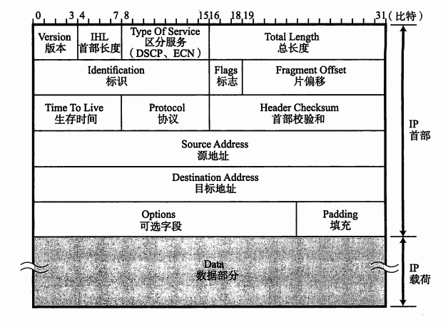

## 5 IP协议相关技术

&emsp;&emsp;IP旨在让最终目标主机收到数据包，但是在这一过程中仅仅有IP是无法实现通信的，必须还有能够解析主机名称和MAC地址的功能，以及在数据包发送过程中异常处理的功能。

### 5.1 DNS

    DNS：Domain Name System，域名系统

&emsp;&emsp;TCP/IP网络中要求每一个互连的计算机都具有其唯一的IP地址，并基于该IP地址进行通信。然而，IP地址是由一串数据序列组成不便于记忆。  
&emsp;&emsp;因此，产生了一个可以有效管理主机名和IP地址之间对应关系的系统——DNS系统。它可以维护一个用来表示组织内部主机名和IP地址之间对应关系的数据库。  
&emsp;&emsp;当用户输入主机名（域名）时，DNS会自动检索注册了主机名和IP地址的数据库，并迅速定位对应的IP地址。有了DNS，不论网络规模变得多么庞大，都能在一个较小的范围内通过DNS进行管理。  
&emsp;&emsp;进行DNS查询的主机和软件叫做`DNS解析器`，用户所使用的工作站或个人电脑都属于解析器。解析器为了调查IP地址，向`域名服务器`进行查询处理，接收这个查询的域名服务器首先在自己的数据库进行查找，如果没有IP返回，就再向上一层`根域名服务器`进行查询处理，直到找到指定的域名服务器。DNS就像互联网中的分布式数据库。

DNS的常用记录有：

|类型|内容|
|---|---|
|A|主机名的IPv4地址|
|NS|域名服务器|
|CNAME|主机别名对应的规范名称|
|AAAA|主机IPv6地址|

### 5.2 ARP

    ARP：Address Resolution Protocol，地址解析协议

&emsp;&emsp;ARP是一种解决地址问题的协议。以目标IP地址为线索，用来定位下一个应该接收数据分包的网络设备对应的MAC地址。

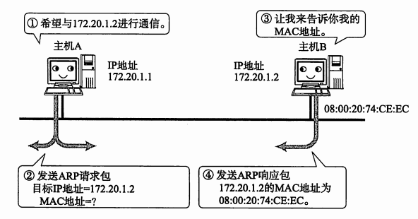

&emsp;&emsp;根据ARP可以动态地进行地址解析，因此，在TCP/IP的网络构造和网络通信中无需实现知道MAC地址，只要有IP地址即可。  

&emsp;&emsp;为何需要IP+MAC地址：因为如果需要通信的两个主机，它们不在同一个数据链路上，那么只知道MAC地址，是不能实现直接主机间的通信的。

### 5.3 ICMP

    ICMP：Internet Control Message Protocol，互联网报文控制协议

&emsp;&emsp;ICMP的主要功能包括，确认IP包是否成功送达目标地址，通知在发送过程当中IP包被废弃的具体原因，改善网络设置等。有了这些功能后，就可以获得网络是否正常、设置是否有误以及设备有何异常等信息，便于进行网络问题诊断。

### 5.4 DHCP

    DHCP：Dynamic Host Configuration Protocol，动态主机设置协议

&emsp;&emsp;为了实现自动设置IP地址、统一管理IP地址分配，就产生了DHCP协议，有了DHCP，计算机只要连接到网络，就可以进行TCP/IP通信（即插即用）。  
&emsp;&emsp;工作机制：使用DHCP之前，首先要架设一台DHCP服务器（很多时候用该网段的路由器充当DHCP服务器），然后将DHCP所要分配的IP地址设置到服务器上，此外，还需将相应的子网掩码、路由控制信息以及DNS服务器的地址等设置到服务器上。

## 6 TCP与UDP

    TCP：Transmission Control Protocol，传输控制协议
    UDP：User Datagram Protocol，用户数据报协议

&emsp;&emsp;传输层的TCP和UDP，负责将自己传输的数据发给具体的应用。传输层通过`端口号`识别传输层上一层的应用层中所要进行处理的具体程序。

### 6.1 端口号

* 数据链路中的地址：MAC地址；识别同一链路中不同的计算机。
* IP中的地址：IP地址；识别TCP/IP网络中互连的主机和路由器。
* 传输层中的地址：端口号；识别同一台计算机中进行通信的不同应用程序，也成为程序地址。

&emsp;&emsp;TCP/IP或UDP/IP通信中通常采用5个信息来识别一个通信，分别是`源IP地址`、`目标IP地址`、`协议号`、`源端口号`、`目标端口号`。

### 6.2 UDP

&emsp;&emsp;UDP不提供复杂的控制机制，利用IP提供面向无连接的通信服务。它将应用程序发来的数据在收到的那一刻，立即按照原样发送到网络上。UDP无法进行流量控制等避免网络拥塞的行为，传输途中即使出现丢包，UDP也不负责重发。甚至当出现包的到达顺序乱掉时也没有纠正的功能。这些细节控制都交由采用UDP的应用程序去处理。  
&emsp;&emsp;UDP面向无连接且随时发送数据，处理简单高效，可以应用于以下几方面：

* 包总量较少的通信（DNS、SNMP等)
* 视频、音频等多媒体通信（即时通信）
* 广播通信（广播、多播）

### 6.3 TCP

&emsp;&emsp;TCP与UDP的区别相当大，它充分地实现了数据传输时各种控制功能，可以进行丢包时的重发控制，还可以对次序乱掉的分包进行顺序控制。TCP时一种面向连接的协议。

#### 6.3.1 确认应答和序列号

&emsp;&emsp;TCP中，当发送端的数据到达接收主机时，接收端主机会返回一个收到消息的确认应答（ACK）。TCP通过肯定的ACK实现可靠的数据传输，当发送端将数据发出之后会等待对端的确认应答，在一定时间内没有等到确认应答，发送端就可以认为数据已经丢失，并进行重发。  
&emsp;&emsp;确认应答处理、重发控制以及重复控制等功能都可以通过序列号实现。序列号是按顺序给发送数据的每一个字节都标上号码的编号。接收端查询接收数据TCP首部中的序列号和数据的长度，将自己下一步该接收的序号作为确认应答返送回去。

#### 6.3.2 连接管理

&emsp;&emsp;TCP的连接和断开又称为“三次握手”和“四次挥手”。

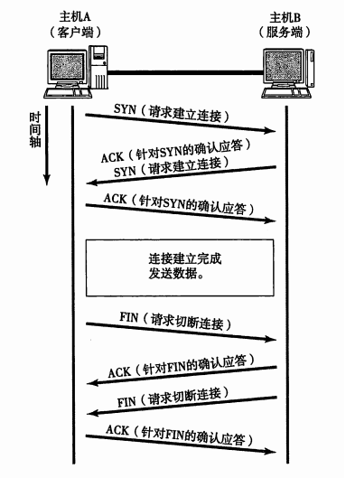

##### 三次握手

&emsp;&emsp;三次握手的目的最主要是双方确认发送方（客户端）和接收方（服务端）的发送和接收是正常的。

|握手次数|C端获得的信息|S端获得的信息|
|---|---|---|
|第1次|无信息|C端发正常|
|第2次|C端收发正常 S端收发正常|C端发正常 S端收正常|
|第3次|C端收发正常 S端收发正常|C端收发正常 S端收发正常|

#### 四次挥手

&emsp;&emsp;断开连接需要进行四次挥手。

* C端发送FIN，关闭C端->S端的数据传送
* S端收到FIN，返回ACK；并查询应用是否还需向C端发送数据
* S端发送完数据，发送FIN，关闭S端->C端的数据连接
* C端返回ACK

### 6.3.3 发送数据的单位

&emsp;&emsp;TCP发送数据包的单位，称为`最大消息长度`（MSS：Maximum Segment Size）。最理想的情况是IP中不会被分片处理的最大的数据长度。

### 6.3.4 窗口控制

&emsp;&emsp;TCP按段传输的方式，每发一个段进行依次确认应答的处理，包的往返时间越长通信性能就越低。  
&emsp;&emsp;因此TCP引入窗口的概念，确认应答不再是以每个分段，而是以更大的单位进行确认。  
&emsp;&emsp;窗口大小就是指无需等待确认应答而可以继续发送数据的最大值。

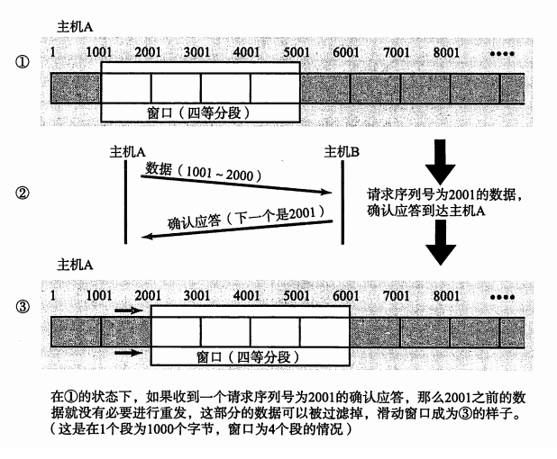

&emsp;&emsp;在使用窗口控制时，某些确认应答即使丢失也无需重发。因为窗口控制采用的时一种高速重发控制ARQ（Automatic Repeat Request）。

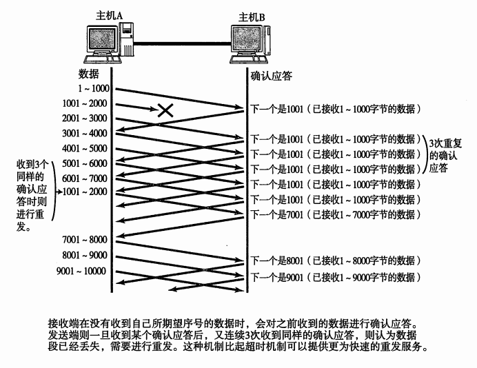

### 6.3.5 拥塞控制

&emsp;&emsp;拥塞控制有四种算法：慢开始、拥塞避免、快重传、快恢复。

#### 1）慢开始和拥塞避免

&emsp;&emsp;发送方维持一个叫做`拥塞窗口cwnd`的状态变量，窗口的大小取决于网络的拥塞程度，并且动态变化。发送方让自己的发送窗口等于拥塞窗口。  

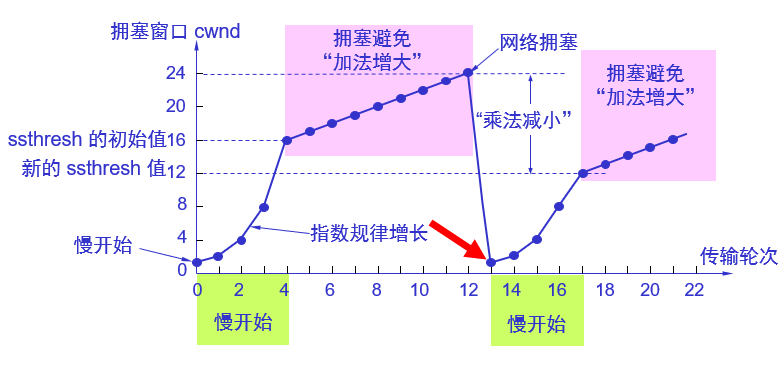

##### a 慢开始

&emsp;&emsp;在主机刚刚开始发送报文段时可先设置拥塞窗口`cwnd=1`，即设置为一个最大报文段`MSS`的数值。在每收到一个对新的报文段的确认后，将拥塞窗口加1，即增加一个MSS的数值。这样cwnd的值随着网络往返时间`RTT(Round Trip Time)`呈`指数级增长`。

##### b 拥塞避免

&emsp;&emsp;TCP设置了一个慢开始增长的门限`ssthresh`，当cwnd超过该值后，慢开始阶段就会结束，进入拥塞避免阶段。拥塞避免的思想是加法增大，此时当窗口中所有的报文段都被确认时，cwnd的大小加1，cwnd随着RTT线性增加，这样可以避免增长过快。

##### c 拥塞处理

&emsp;&emsp;TCP判断网络拥塞的依据是没有按时收到确认，即重传了一个报文段。这时，`ssthresh`降低为cwnd的一半，cwnd置1，然后重新进入慢开始阶段。  
&emsp;&emsp;总体来说，TCP拥塞控制窗口变化的原则就是`加法增大，乘法减小`。

#### 2） 快重传和快恢复

##### a 快重传算法

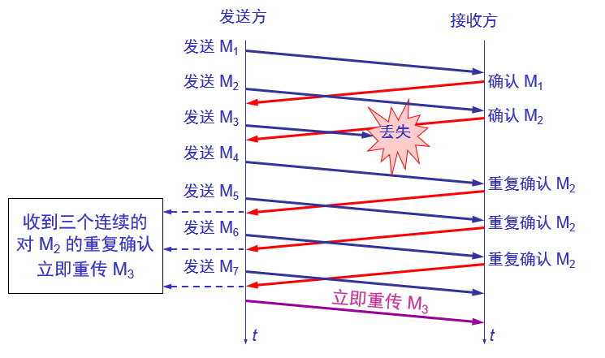

&emsp;&emsp;快重传算法要求接收方每收到一个失序的报文段后就立即发出重复确认。这样做可以让发送方及早知道有报文段没有到达接收方。发送方只要一连收到三个重复确认就应当立即重传对方尚未收到的报文段。

##### b 快恢复算法

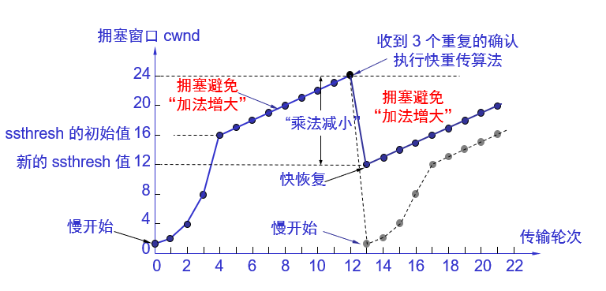

&emsp;&emsp;当发送端收到连续三个重复的确认时，就执行“乘法减小”算法，把慢开始门限`ssthresh`减半。但接下来不执行慢开始算法。  
&emsp;&emsp;由于发送方现在认为网络很可能没有发生拥塞，因此不执行慢开始算法，即拥塞窗口`cwnd`不置为1，而是设置为慢开始门限ssthresh减半后的数值，然后开始执行拥塞避免算法，即“加法增大”，使拥塞窗口缓慢线性增大。

### 6.4 UDP首部格式

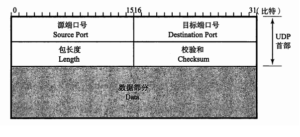

### 6.5 TCP首部格式

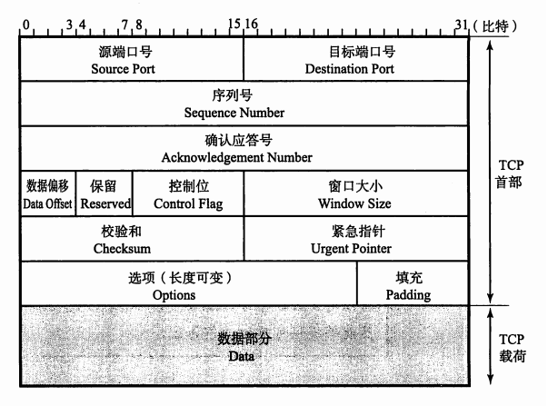

其中，控制位为8位，ACK、SYN以及FIN都在其中：

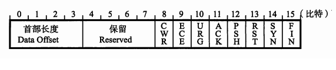

## 7 HTTP

    HTTP:HyperText Transfer Protocol，超文本传输协议

### 7.1 和HTTP关系密切的协议

* IP协议位于网络层，作用是将各种数据包传送给对方。
* ARP协议根据通信方的IP地址反查出对应的MAC地址。
* TCP协议位于传输层，提供可靠的字节流服务（为了方便传输，将大块数据分割成以报文段为单位的数据包进行管理）。
* DNS服务和HTTP协议一样位于应用层，它提供域名到IP地址之间的解析服务。

### 7.2 URI和URL

    URI：Uniform Resource Identifier，统一资源标识符
    URL：Uniform Resource Locator，统一资源定位符

&emsp;&emsp;URL就是使用Web浏览器等访问Web页面时需要输入的网页地址。  
&emsp;&emsp;URI是某个协议方案表示的资源的定位标识符。其中，协议方案就是指访问资源所使用的协议类型名称。  
&emsp;&emsp;URI用字符串标识某一互联网资源，而URL标识资源的地点（互联网上所处的位置），所以URL是URI的子集。

### 7.3 HTTP协议的特点

* 用于客户端和服务器之间的通信：应用HTTP协议时，必定是一段担任客户端角色，另一端担任服务器端角色。请求由客户端发出，而服务端回复响应。