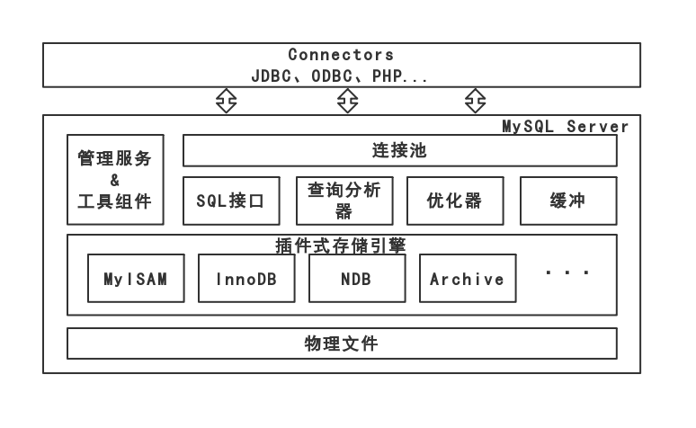

# Mysql

>参考资料：MySQL技术内幕 InnoDB存储引擎 第二版

## 目录

* [1 体系结构和存储引擎](#1-体系结构和存储引擎)
* [2 InnoDB存储引擎](#2-InnoDB存储引擎)

## 1 体系结构和存储引擎

### 1.1 数据库和实例

* 数据库：物理操作系统文件和其他形式文件类型的集合。
* 实例：MySQL数据库由后台线程和一个共享内存区族称，MySQL数据库实例在系统上的表现就是一个进程。

### 1.2 体系结构

&emsp;&emsp;MySQL数据库区别于其他数据库的最重要的一个特点就是插件式的表存储引擎。存储引擎是基于表的，而不是数据库。

### 1.3 MySQL存储引擎

#### 1.3.1 InnoDB

* 支持事务，面向在线事务处理；
* 行锁设计、支持外键，默认读取操作不产生锁；
* 通过多版本并发控制（MVCC）来获得高并发性；
* 用next-key-lock避免幻影读；
* InnoDB同时采聚集方式，每张表的存储都是按主键的顺序存放；

#### 1.3.2 MyISAM

* 不支持事务、表锁设计，支持全文索引；
* 主要面向在线分析处理；
* 缓存池只缓存索引文件，不缓存数据文件；
* MySQL5.0之前默认表大小为4GB，5.0之后默认支持256TB的单表数据；

## 2 InnoDB存储引擎